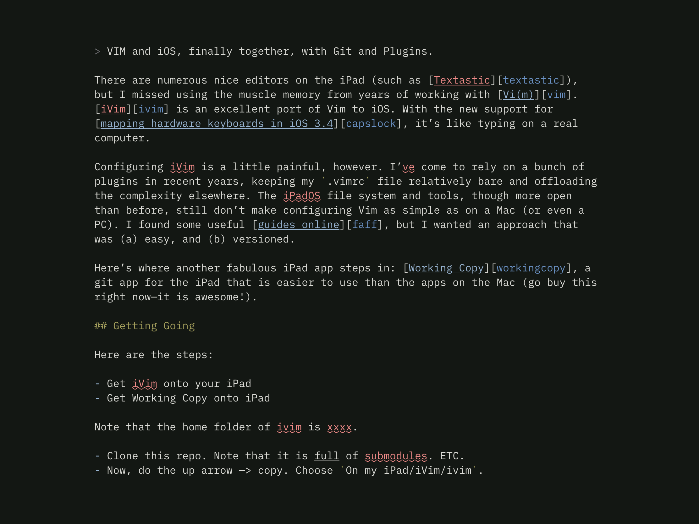

# This is my [iVim][ivim] setup. 

> VIM and iOS, finally together, with Git and Plugins.



There are numerous nice editors on the iPad, such as [Textastic][textastic]. But if you’ve spent years establishing the muscle memory with [Vi(m)][vim], switching to a non-vim-like editor is hard. I recently came across [iVim][ivim], an excellent port of Vim to iOS. With new support for [mapping hardware keyboards in iOS 3.4][capslock], you can even have an escape key, or map caps-lock to something useful.

I’ve taken keeping my `.vimrc` file relatively bare in recent years, offloading the complexity to plugins instead. Replicating the use of Plugins on the iPad turns out to a little painful. I found some useful [guides online][faff], but I wanted an approach that (a) had minimal faffing amount, and (b) was versioned.

Here’s where another fabulous iPad app steps in: [Working Copy][workingcopy], a git app for the iPad that is easier to use than the apps on the Mac (go buy this right now—it is awesome!).

## Getting Going

1. Get iVim on your iPad (it’s free, but for the price of breakfast, you can support this project).
2. Get Working Copy on your iPad (again, free for just cloning. But well worth the money for a pro upgrade).
3. Clone this repo using Working Copy. This repo is *full* of submodules (these are the plugins). Working Copy will ask if you want to clone all the submodules too. You’ll need to do that too. If you neglect to do it at first, you can clone them by going into each separate folder and selecting “clone”.
3. The home folder of ivim is `On my iPad/iVim`. iVim will have easy access to everything in this folder (it can access other things using the `idocument` command — see the docs). We want to put this repository and all the submodules into that folder. Working copy has an easy way to do this, via its `Synced Directory` functionality. Whilst in the ivim folder in Working Copy, hit the share button (the up-arrow on the top right), and pick `Setup Directory Sync`. Then create a folder called `ivim` under the `On my iPad/iVim` folder and sync it. Working copy will synchronise that folder with the repo folder, so everything you just cloned is now copied to that folder.
4. The last thing to do is to open iVim and create your `.vimrc` file to take advantage of all the plugins. You just need to add one line to this file: `source ~/ivim/vimrc`. Your `.vimrc` simply loads the `vimrc` file that is in the repo, and synced to this folder. This file uses [pathogen][pathogen] to load all of the plugins in the submodules.
5. Exit iVim and restart it. If all has gone well, all of the plugins will be available.
6. Make any configuration changes to this `vimrc` and *not in your actual `.vimrc`* in the home folder. Any changes will be synced to Working Copy, and you can commit and push them to your git repo.


## Modifying and updating your plugins

The set of plugins in this repo are what I’m currently playing with on the iPad. They’re mostly for writing in markdown or LaTeX, some additional buffer/file handling, and a great set of colour schemes. Many modern plugins rely on other system tools that aren’t available on the iPad. So I’ve chosen plugins that require only vim-script (VimTeX is an exception; but I only use some parts of it). There are plenty of other plugins you can install, but be not all of them will work on the iPad.

Although Working Copy supports submodules cloning, I have not found an easy way of adding and removing submodules on the iPad. So I do this my Mac. Clone the repo locally, then add or remove plugins using the git submodule commands. Adding submodules is easy, removing them requires a bit of faffing about.

```sh
[~/code/ivim]$ git submodule add plugins

```

```sh
git submodule deinit
git rm

```


[faff]: https://www.reddit.com/r/vim/comments/9ki5g8/ivim_ios_howtos/
[vim]: https://www.vim.org
[ivim]: https://github.com/terrychou/iVim
[textastic]: https://www.textasticapp.com
[capslock]: https://www.idownloadblog.com/2020/02/06/ipados-13-4-hardware-key-remapping/
[workingcopy]: https://workingcopyapp.com
[texpad]: https://www.texpad.com
[pathogen]: https://github.com/tpope/vim-pathogen

